# Documentation Of TILED in Hunter Assassin

*Written by Yiğithan Aydın*

## TILED PART

The old system had a very uniform and inflexible working structure. Firstly, within TILED, there is a layer for each drawing location.

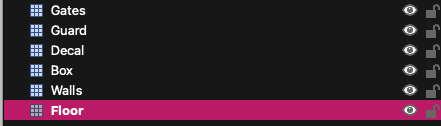

TileSets are as follows. If you want to add a new tile, press "edit tileset" and then import the image.

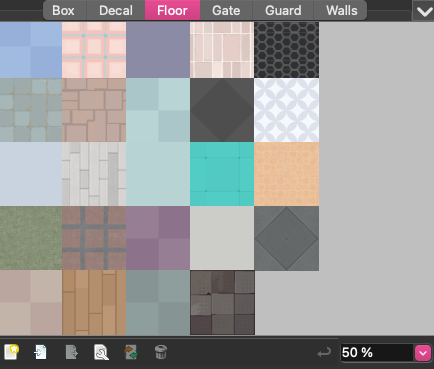

Next, let's run the TileFixer script located inside the TileSets folder.

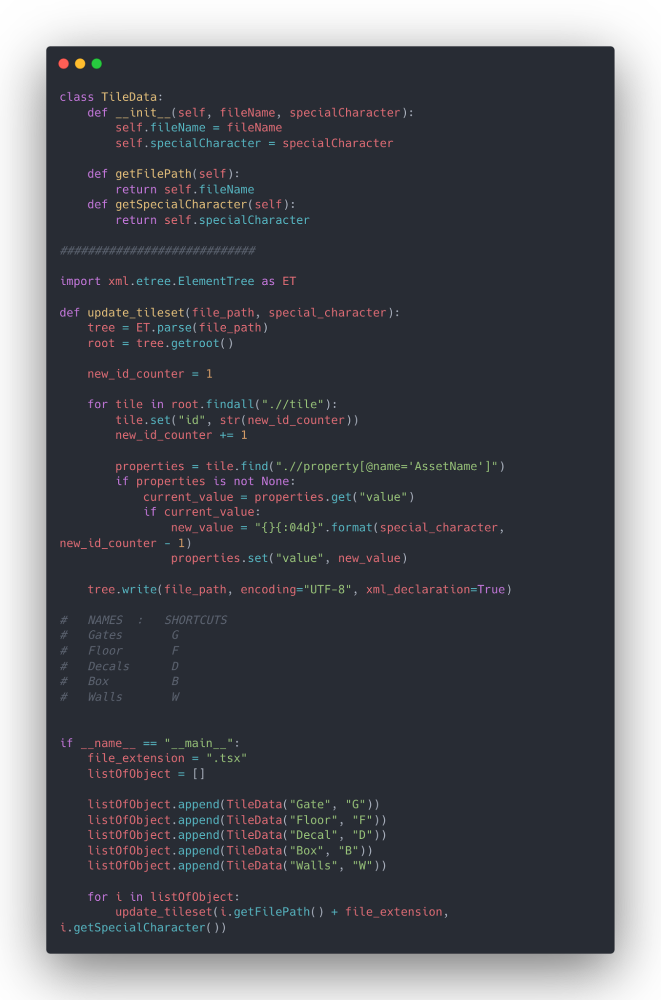

This script has a section that adds shortcuts. It also sets the IDs of the tsx file (because adding a new tile may cause disruptions in the IDs). Additionally, it performs naming corrections by numbering them sequentially (for example, 0001-0002-000n).

### Shortcuts for Layers

| NAMES    | SHORTCUTS |
|----------|-----------|
| Gates    | G         |
| Floor    | F         |
| Decals   | D         |
| Box      | B         |
| Walls    | W         |

The script below is named ChangeName.

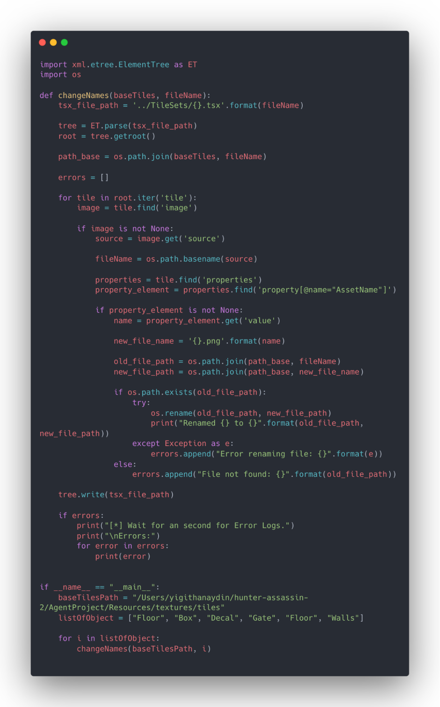

Correct naming is done within Hunter's texture section. You may need to change the value in BaseTilesPath.

## COCOS PART

TileReader reads the incoming map data and stores IDs, Layer names, and GUID numbers as TileLayerInfo.

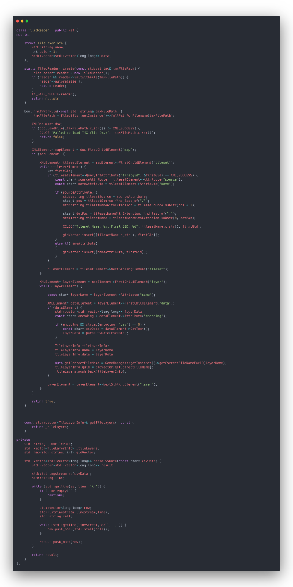

This function reads all the IDs.

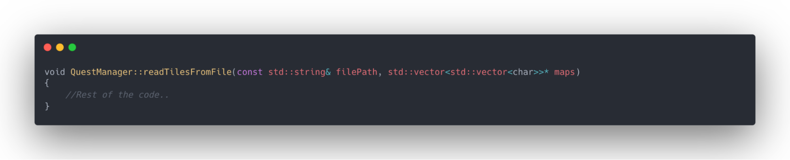

The codes inside the function are as follows: To explain, the received TileData is examined in a loop, separately for each layer. These layers, including flip information and tile name, are all saved.

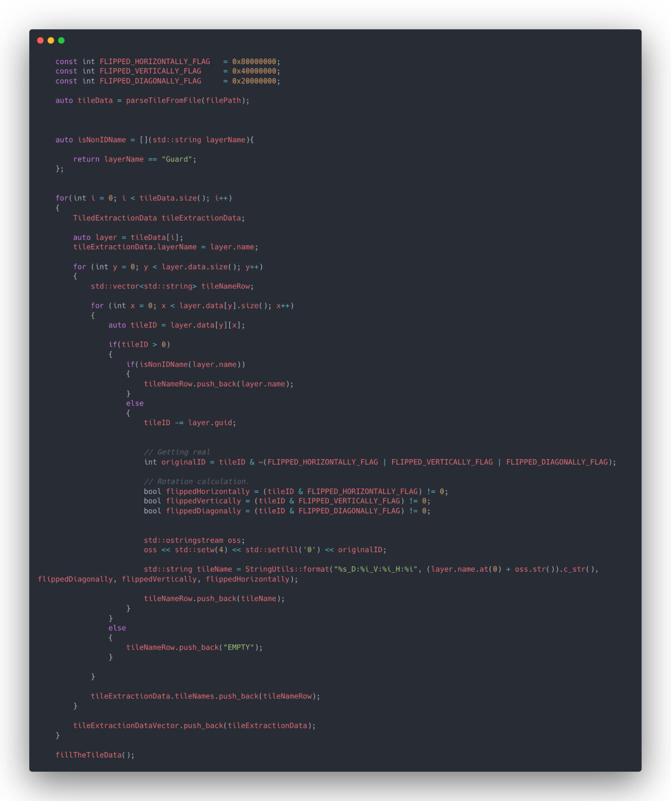

The crucial part starts here. If the tile has vertically flipped, it is marked as V:1; if it has diagonal flip, it is marked as D:1; if it has horizontal flip, it is marked as H:1. A file name, such as F0001, is added to the beginning of the text, and the resulting output becomes F0001_D:1_V:1_H:1. It is processed mutually as a map in Tile Coordinates.

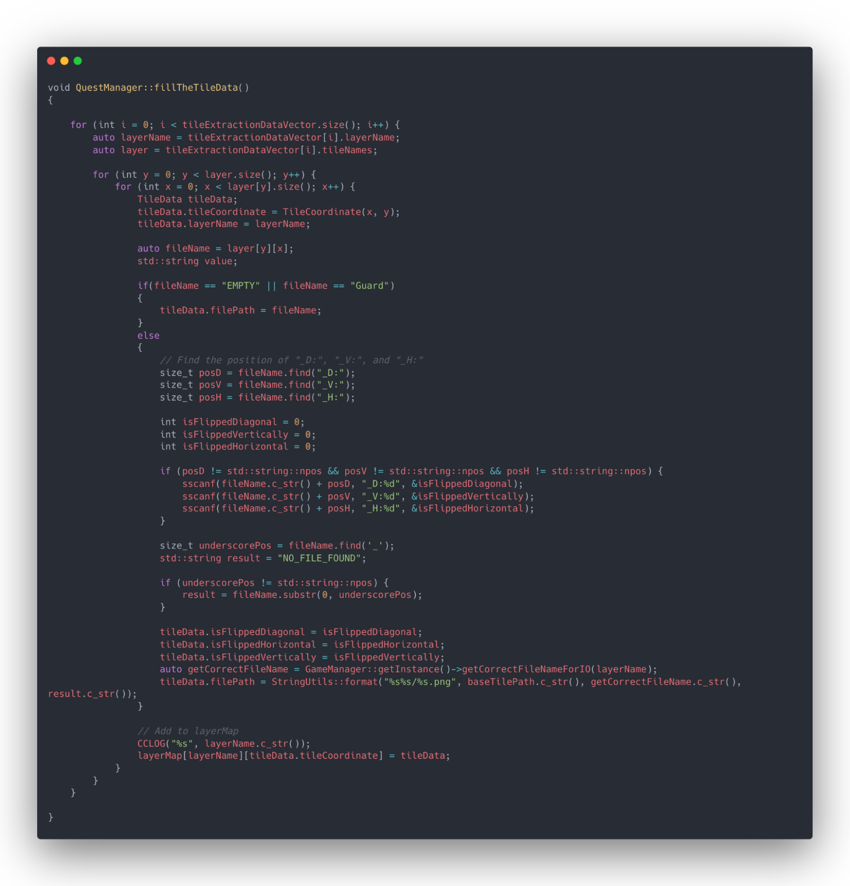

GetTileDataAtCoord function is the most frequently used function, as a layer name enum (see).

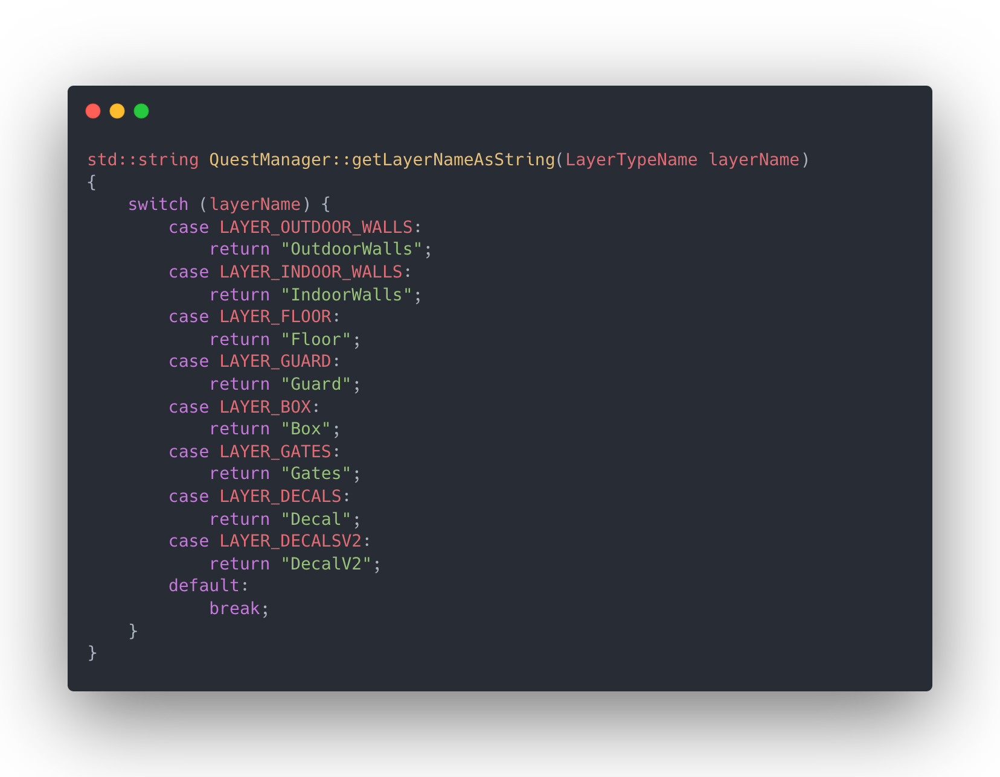

If there is a corresponding Coord, the GetTileDataAtCoord function returns TileData.

The getCorrectFileNameForIO function is used for layers where we need to export with different names, but essentially they are the same. For example, IndoorWalls or OutdoorWalls actually belong to the Wall class, but different naming is used because they are used in different calculations within the game.

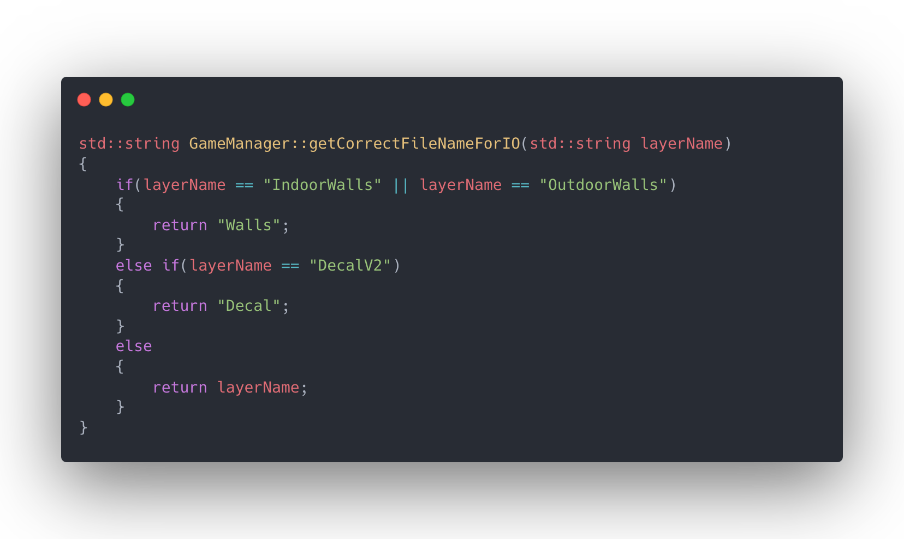

Additionally, the DecalV2 function allows us to stack multiple decals on top of each other while also serving as a decal layer.

IsWallSolid function checks whether the wall exists. Here, if it is "EMPTY," it serves a purpose; if we replace it with "EMPTY" in places like removeWall or addWall, it behaves as if there is no wall. However, if done under the conditions of creating the map, it skips the wall.

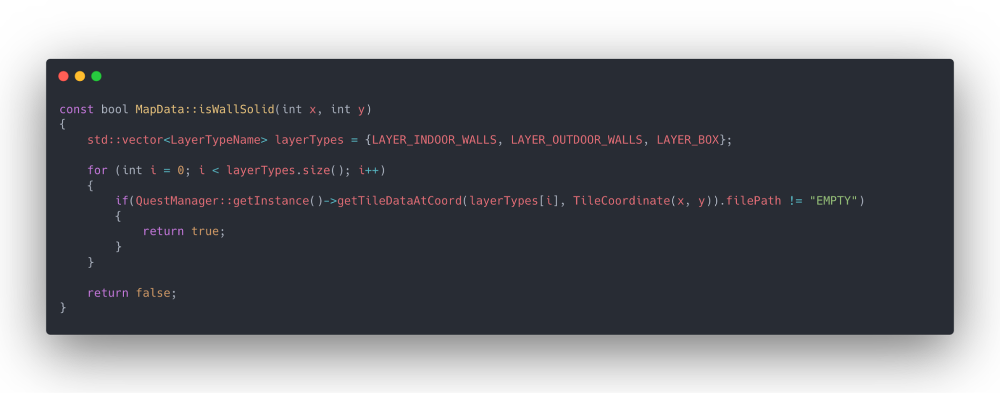

This part includes the particles and files created where the walls are broken.

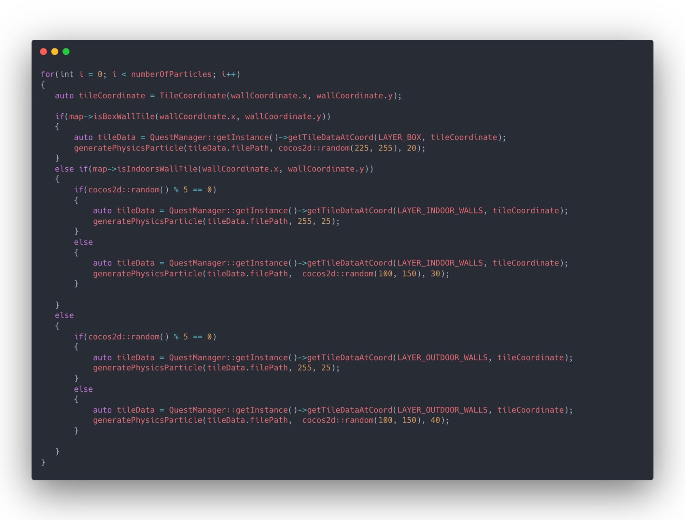

Stacking decals on top of each other, creating walls, and many other events are done in the tile creation part. That part is here.

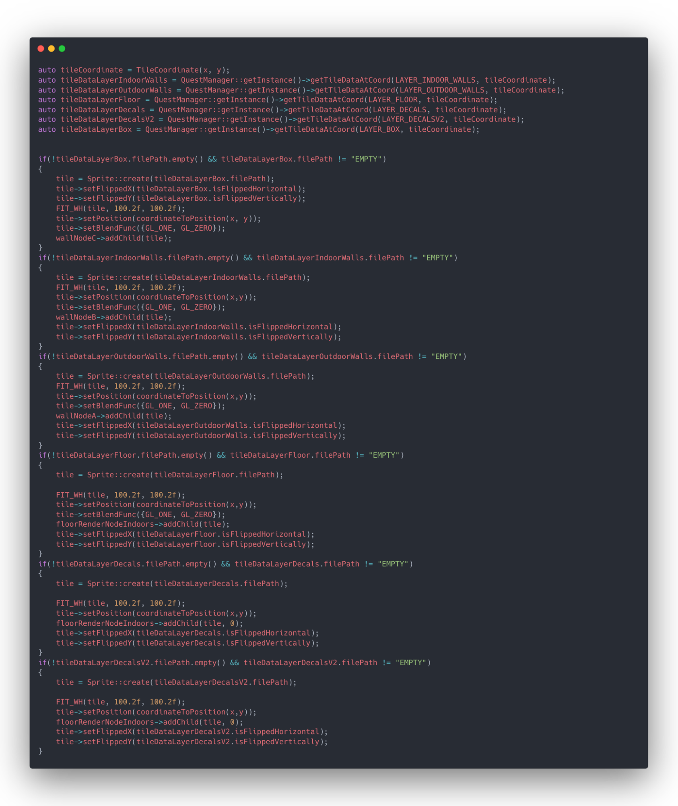

## TO-DO

This section is utilized as a to-do list, where I note the parts that need to be added or are missing in the game:

- Guards must be added to the object layer and should be present in TileReader where it reads guard configurations.
- Traps and Chests must be added to the object layer.
- Doors must be added to the object layer.
- The movement path of guards needs to be fixed.

So why are the places where object layers need to be added not present in the game already?

Because we decided to switch to an in-studio tool outside of Tiled, and due to Tiled's poor performance, object layer sections were hidden at the end.

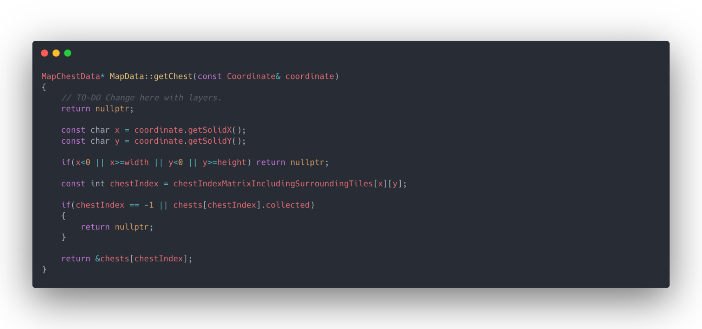

The GetChest function checks if there is a chest at the specified location and returns ChestData. This part can be placed inside the QuestManager.

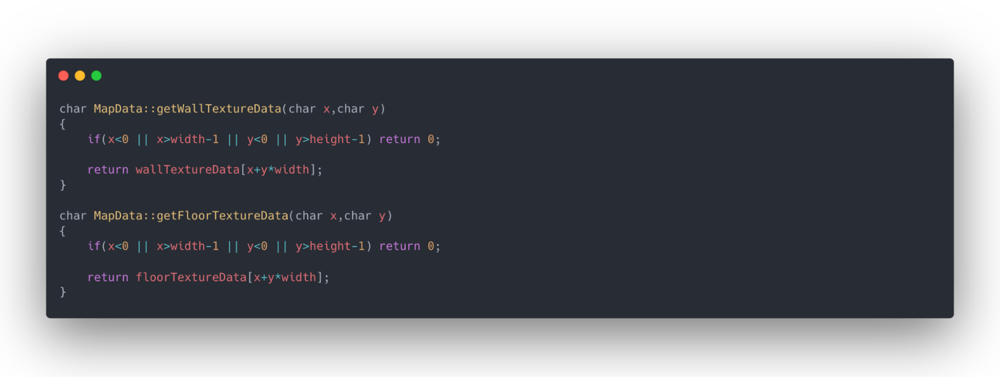

The sections below return Texture data. I haven't experimented with this part yet, as I'm not sure about the configuration.

If any of you have configured it and come up with a good setting, please let me know.

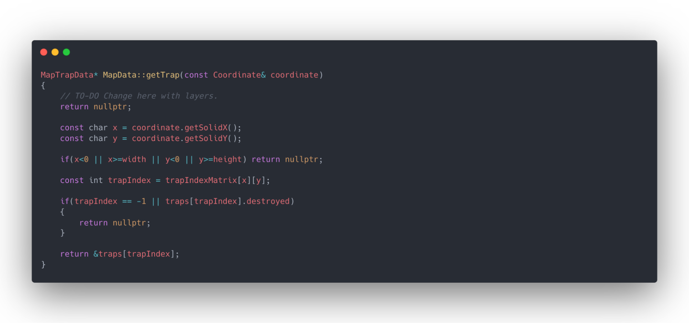

I hope this documentation is helpful! Feel free to contribute to the development.
